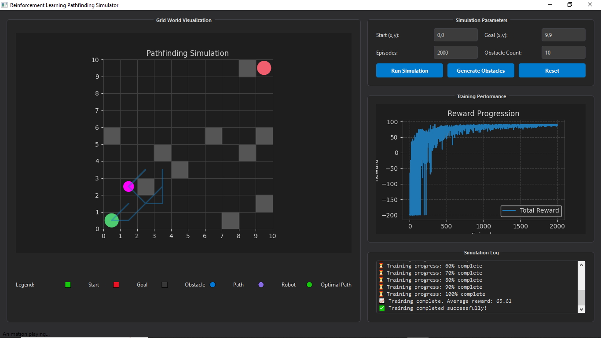

# 🧠 Robot Navigation using Q-Learning (PyQt6 GUI)

This project is a visual simulation of a robot learning to navigate a 2D grid environment using **Q-Learning**, implemented with a modern **PyQt6 GUI**. It allows users to configure environments, run training, and visualize optimal paths in an interactive, intuitive interface.

## 🚀 Features

- 🔧 **Interactive GUI** built with PyQt6.
- 📦 Modular design with real-time visualization using Matplotlib.
- 🎯 Q-Learning algorithm for autonomous path planning.
- 🧱 Obstacle generation (manual or randomized).
- 📈 Live training progress with reward plotting.
- 🧠 Customizable hyperparameters (alpha, gamma, epsilon, episodes).
- ✅ Pathfinding validation and training with early stopping.

---

## 🖼️ Screenshots

  
*Include a screenshot of the GUI with the robot navigating obstacles.*

---

## 🛠️ Installation

Make sure you have **Python 3.9+** installed.

### 1. Clone the repository

```bash
git clone https://github.com/Emmanuelprime/Q-Learning-RL-Navigation.git
cd robot-rl-navigation
